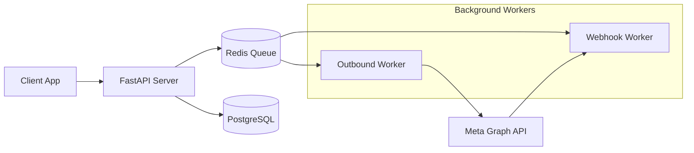

# TREEEX WhatsApp Business Solution Provider (WBSP)

[](https://python.org)
[](https://fastapi.tiangolo.com)
[](https://www.postgresql.org)
[](https://redis.io)
[](LICENSE)

> A robust, high-performance WhatsApp Business Solution Provider platform built for scale.

---

## 📖 Documentation

Everything you need to build, deploy, and use TREEEX-WBSP.

<div align="center">

| **Getting Started** | **Guides** | **Technical Reference** |
|:---:|:---:|:---:|
| [🏠 **Setup Guide**](docs/SETUP.md)<br>_Install & Run Locally_ | [📚 **Usage Guide**](docs/USAGE.md)<br>_Sending Messages & Campaigns_ | [🏗️ **Architecture**](docs/ARCHITECTURE.md)<br>_System Design & Diagrams_ |
| [🚀 **Deployment**](docs/DEPLOYMENT.md)<br>_Production Guide_ | [🛡️ **Best Practices**](docs/BEST_PRACTICES.md)<br>_Security & Performance_ | [🔌 **API Reference**](docs/API_REFERENCE.md)<br>_Endpoints & Schemas_ |
| [🧪 **Testing**](docs/TESTING.md)<br>_Running Tests & CI/CD_ | [🔧 **Troubleshooting**](docs/TROUBLESHOOTING.md)<br>_Common Issues & Fixes_ | [🗄️ **Database**](docs/DATABASE_SCHEMA.md)<br>_Schema & Migrations_ |

</div>

---

## ✨ Key Features

- **🚀 High Performance**: Built on **FastAPI** with asynchronous processing for maximum throughput.
- **🔄 Reliable Messaging**: **Redis**-backed queues ensure message delivery with automatic retries and dead-letter handling.
- **🔐 Enterprise Security**: **Supabase** authentication, role-based access control (RBAC), and multi-tenant workspace isolation.
- **☁️ Scalable Storage**: **Azure Blob Storage** integration for handling rich media at scale.
- **🔌 Developer Friendly**: Built-in **ngrok** integration for seamless local webhook testing.
- **📊 Interactive Docs**: Auto-generated **OpenAPI** documentation with Swagger UI and ReDoc.

---

## ⚡ Quick Start

Get up and running in minutes.

### Prerequisites
- Python 3.11+
- Redis & PostgreSQL
- [uv](https://docs.astral.sh/uv/) (Recommended)

### Installation

```bash
# 1. Clone the repository
git clone https://github.com/your-org/TREEEX-WBSP.git
cd TREEEX-WBSP

# 2. Install dependencies
uv sync
uv pip install -e ".[dev]"

# 3. Configure Environment
cp .env.example server/.env
# Update server/.env with your credentials
```

For detailed instructions, see the [Setup Guide](docs/SETUP.md).

---

## 🧩 Architecture Overview

The system follows an event-driven microservices architecture.



See [Architecture Documentation](docs/ARCHITECTURE.md) for full details.

---

## 🤝 Contributing

We welcome contributions! Please see [CONTRIBUTING.md](CONTRIBUTING.md) for guidelines on how to submit PRs, report issues, and set up your development environment.

## 📄 License

This project is licensed under the MIT License - see the [LICENSE](LICENSE) file for details.

---

<div align="center">
  <sub>Built with ❤️ by the TREEEX Team</sub>
</div>
