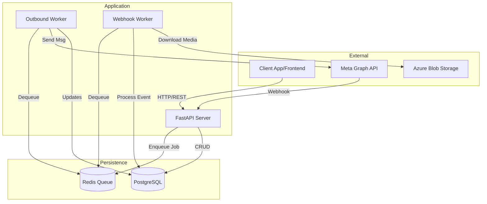

# 🏗️ Architecture

HIGH-LEVEL DESIGNS AND COMPONENT INTERACTIONS.

## 🔭 System Overview

TREEEX-WBSP follows an **Event-Driven Microservices** pattern (monolith deployment, micro-logic).



---

## 🧩 Core Components

### 1. API Server (`server/api`)
- **Framework**: FastAPI
- **Responsibility**: Handle HTTP requests, auth, validation, and enqueue jobs.
- **Scaling**: Stateless, horizontally scalable behind a load balancer.

### 2. Outbound Worker (`server/workers/outbound.py`)
- **Role**: Rate-limited message sender.
- **Logic**:
  1. Reads from `queue:outbound`.
  2. Checks Rate Limits (via Redis).
  3. Calls Meta API.
  4. Updates Message status (SENT/FAILED).
  5. Backs off on 429 errors.

### 3. Webhook Worker (`server/workers/webhook.py`)
- **Role**: High-throughput event processor.
- **Logic**:
  1. API receives webhook -> Verifies signature -> Pushes to `queue:webhooks`.
  2. Worker processes event (Message/Status).
  3. Writes to DB (Async).
  4. Downloads media if present.

### 4. Messaging Architecture

The outbound messaging follows a **Command → Renderer → Client** pattern:

```
┌─────────────────┐     ┌─────────────────┐     ┌─────────────────┐
│ Pydantic Command│────▶│    Renderer     │────▶│  OutboundClient │
│   (Validation)  │     │  (Dict Builder) │     │   (HTTP Send)   │
└─────────────────┘     └─────────────────┘     └─────────────────┘
```

| Layer | File | Purpose |
|-------|------|---------|
| **Commands** | `schemas/outbound.py` | Pydantic models validating business input |
| **Renderer** | `whatsapp/renderer.py` | Converts commands to WhatsApp API dicts |
| **Client** | `whatsapp/outbound.py` | HTTP transport to Meta Graph API |

---

## 💡 Key Design Decisions (ADRs)

### ADR-001: Async Webhook Processing
- **Context**: Meta requires webhooks to respond in <3s.
- **Decision**: API only accepts the hook and pushes to Redis. Processing happens asynchronously.
- **Consequence**: High reliability, but small delay in DB consistency.

### ADR-002: Token Management
- **Context**: System User Tokens are long-lived but finite.
- **Decision**: Store tokens encrypted in `phone_numbers` table.
- **Consequence**: Easier setup than OAuth, but requires manual token rotation if compromised.

### ADR-003: Media Storage
- **Context**: Direct binary storage in DB is expensive.
- **Decision**: Use Azure Blob Storage (or S3-compatible); DB only stores URL/Metadata.
- **Consequence**: Faster DB backups, cheaper storage.

---

## 🛠️ Technology Stack

| Component | Technology | Reason |
|:---|:---|:---|
| **Language** | Python 3.11+ | Modern async features, strong typing. |
| **Web Framework** | FastAPI | Performance, auto-docs (OpenAPI). |
| **Database** | PostgreSQL 16 | JSONB support, reliability. |
| **ORM** | SQLAlchemy 2.0 | Best-in-class SQL toolkit. |
| **Queue** | Redis | Low latency, simple list primitives. |
| **Package Manager** | uv | Extremely fast dependency resolution. |
