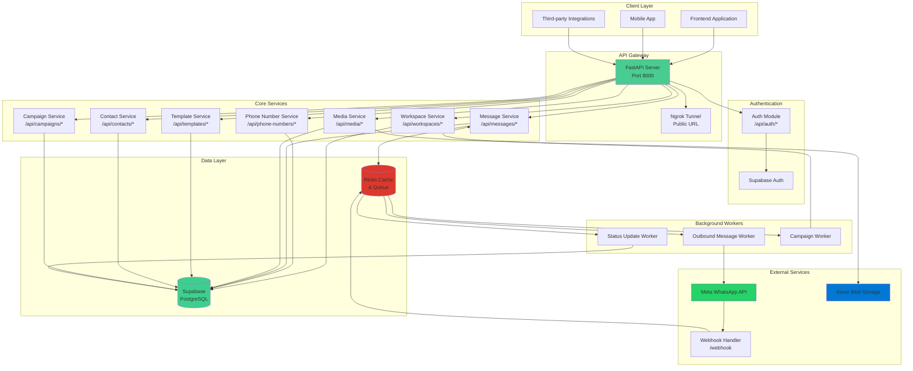
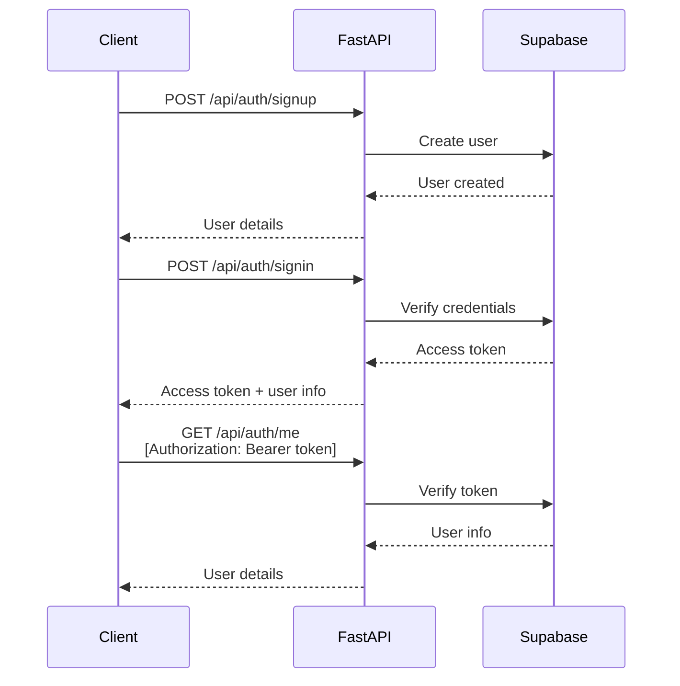
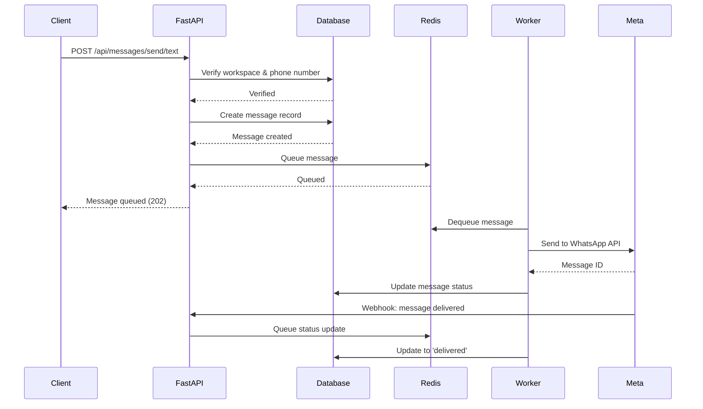
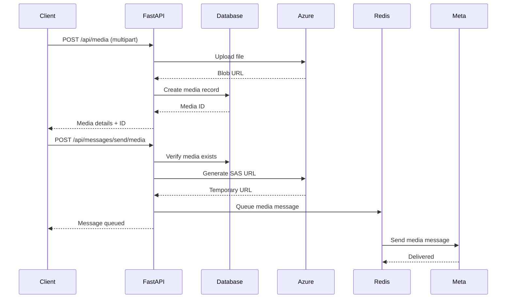
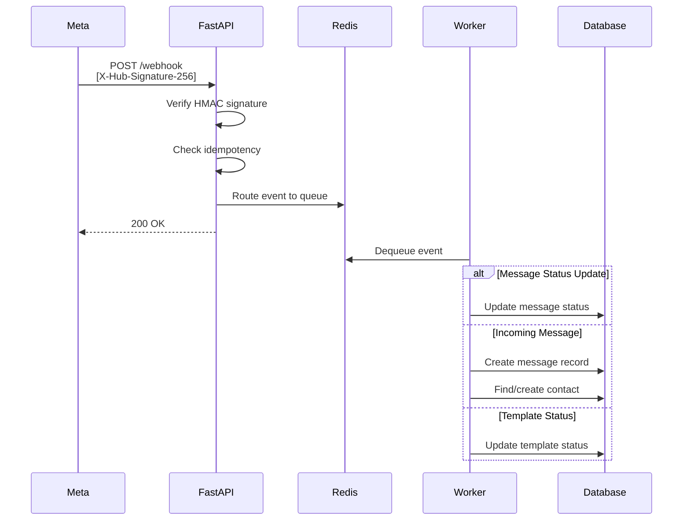
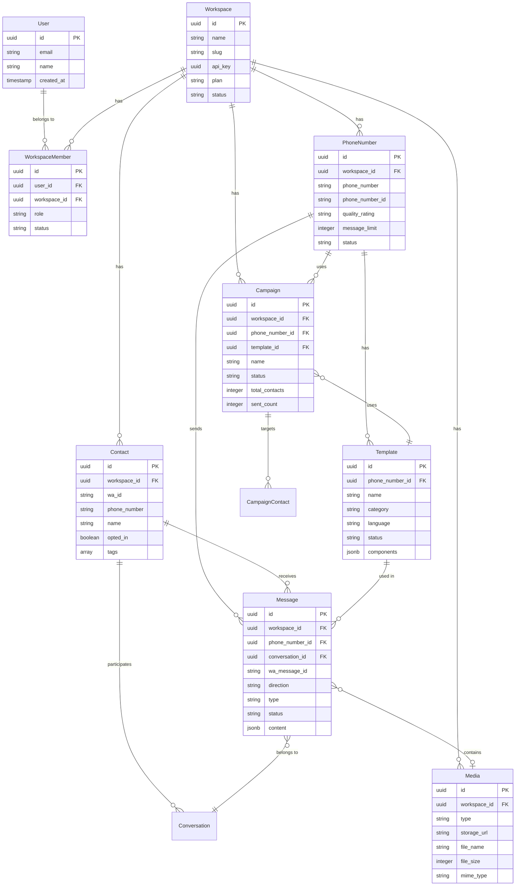
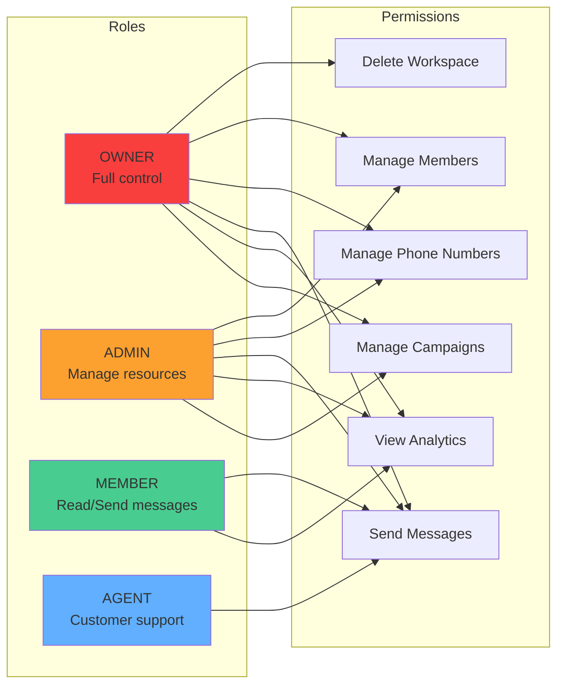
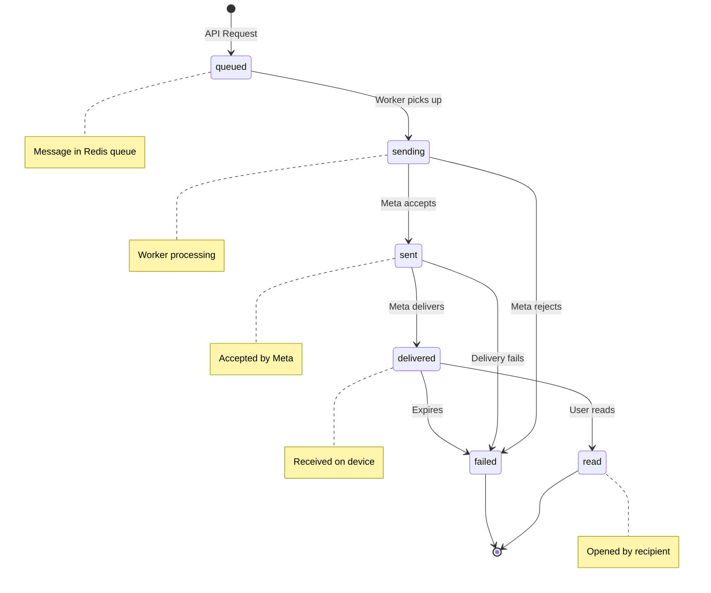
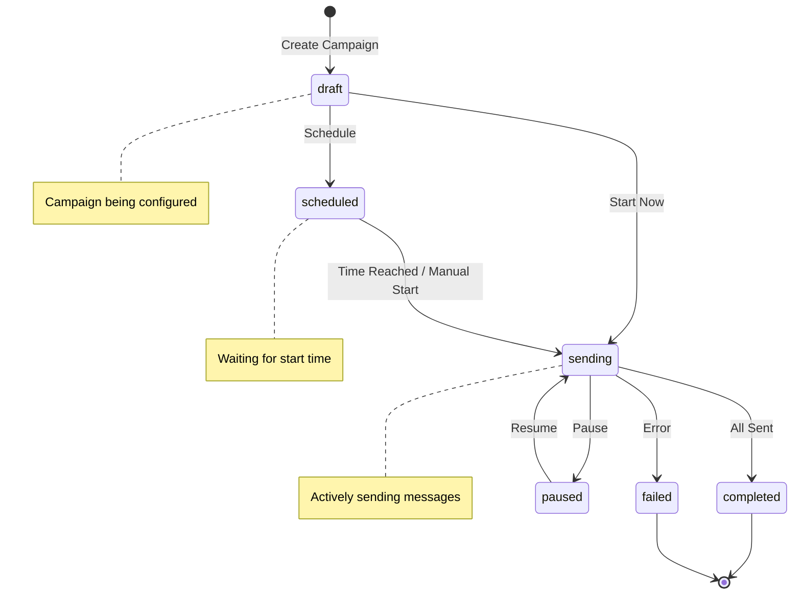

# API Architecture Overview

## System Architecture



## Request Flow

### 1. Authentication Flow



### 2. Send Message Flow



### 3. Media Upload & Send Flow



### 4. Webhook Processing Flow



## Data Models

### Core Entities



## API Endpoint Structure

```
TREEEX WhatsApp Business API
│
├── /webhook (Public - No Auth)
│   ├── GET  - Webhook verification
│   └── POST - Receive Meta events
│
└── /api (Authenticated)
    │
    ├── /auth
    │   ├── POST /signup      - Create account
    │   ├── POST /signin      - Login
    │   ├── POST /refresh     - Refresh token
    │   └── GET  /me          - Current user
    │
    ├── /workspaces
    │   ├── GET    /                      - List workspaces
    │   ├── POST   /                      - Create workspace
    │   ├── GET    /{id}                  - Get workspace
    │   ├── PATCH  /{id}                  - Update workspace
    │   ├── DELETE /{id}                  - Delete workspace
    │   ├── GET    /{id}/members          - List members
    │   └── POST   /{id}/members          - Add member
    │
    ├── /phone-numbers
    │   ├── GET    /                      - List phone numbers
    │   ├── POST   /                      - Register phone number
    │   ├── GET    /{id}                  - Get phone number
    │   ├── PATCH  /{id}                  - Update phone number
    │   ├── DELETE /{id}                  - Delete phone number
    │   ├── POST   /{id}/sync             - Sync from Meta
    │   └── POST   /{id}/exchange-token   - Get long-lived token
    │
    ├── /messages
    │   ├── POST /send/text               - Send text message
    │   ├── POST /send/template           - Send template message
    │   ├── POST /send/media              - Send media message
    │   └── GET  /{id}/status             - Get message status
    │
    ├── /media
    │   ├── GET    /                      - List media files
    │   ├── POST   /                      - Upload media
    │   ├── GET    /{id}                  - Get media details
    │   ├── DELETE /{id}                  - Delete media
    │   ├── GET    /{id}/download         - Download media (redirect)
    │   └── GET    /{id}/url              - Get signed URL
    │
    ├── /templates
    │   ├── GET    /                      - List templates
    │   ├── POST   /                      - Create template
    │   ├── GET    /{id}                  - Get template
    │   ├── PATCH  /{id}                  - Update template
    │   └── DELETE /{id}                  - Delete template
    │
    ├── /contacts
    │   ├── GET    /                      - List contacts
    │   ├── POST   /                      - Create contact
    │   ├── GET    /{id}                  - Get contact
    │   ├── PATCH  /{id}                  - Update contact
    │   ├── DELETE /{id}                  - Delete contact
    │   └── POST   /import                - Import from CSV/Excel
    │
    └── /campaigns
        ├── GET    /                      - List campaigns
        ├── POST   /                      - Create campaign
        ├── GET    /{id}                  - Get campaign
        ├── PATCH  /{id}                  - Update campaign
        ├── DELETE /{id}                  - Delete campaign
        ├── POST   /{id}/start            - Start campaign
        └── POST   /{id}/pause            - Pause campaign
```

## Security & Permissions

### Role-Based Access Control (RBAC)



### Authentication Flow

1. **Sign Up** → Email + Password → User created in Supabase
2. **Sign In** → Email + Password → Access token (JWT)
3. **API Calls** → Bearer token in Authorization header
4. **Token Refresh** → POST /api/auth/refresh

## Message Status Lifecycle



## Campaign Workflow



## Technology Stack

### Backend
- **Framework**: FastAPI (Python)
- **Server**: Uvicorn (ASGI)
- **Validation**: Pydantic
- **Tunneling**: Ngrok (for local development)

### Data & Storage
- **Database**: Supabase (PostgreSQL)
- **Authentication**: Supabase Auth
- **Cache/Queue**: Redis
- **File Storage**: Azure Blob Storage

### External APIs
- **WhatsApp**: Meta Cloud API
- **Webhooks**: HMAC-SHA256 signature verification

### Background Processing
- **Queue**: Redis Queue (RQ)
- **Workers**: Python background workers

## Rate Limits & Quotas

### API Rate Limits (by Plan)

| Plan       | Requests/Hour | Requests/Day | Concurrent |
|------------|---------------|--------------|------------|
| Free       | 100           | 1,000        | 2          |
| Pro        | 1,000         | 10,000       | 10         |
| Enterprise | Custom        | Custom       | Custom     |

### WhatsApp Message Limits (by Quality Rating)

| Quality   | Tier      | Daily Limit     |
|-----------|-----------|-----------------|
| Green     | Standard  | 1,000           |
| Green     | Medium    | 10,000          |
| Green     | High      | 100,000         |
| Yellow    | Any       | Limited (50%)   |
| Red       | Any       | Severely Limited|

### File Upload Limits

| Media Type | Max Size | Formats                      |
|------------|----------|------------------------------|
| Image      | 16 MB    | JPEG, PNG, GIF, BMP          |
| Video      | 100 MB   | MP4, 3GPP, QuickTime         |
| Audio      | 16 MB    | AAC, MP4, MPEG, AMR, OGG    |
| Document   | 100 MB   | PDF, DOC, XLS, PPT, TXT     |

## Error Codes

| Code | Meaning              | Action                          |
|------|----------------------|---------------------------------|
| 200  | Success              | -                               |
| 201  | Created              | -                               |
| 204  | No Content           | -                               |
| 400  | Bad Request          | Check request parameters        |
| 401  | Unauthorized         | Provide valid access token      |
| 403  | Forbidden            | Check workspace permissions     |
| 404  | Not Found            | Resource doesn't exist          |
| 422  | Validation Error     | Fix request body/parameters     |
| 429  | Too Many Requests    | Slow down, check rate limits    |
| 500  | Server Error         | Contact support                 |

## Quick Reference

### Base URLs
- **Public API:** `https://destined-severely-serval.ngrok-free.app`
- **Local Development:** `http://localhost:8000`
- **Interactive Docs:** `http://localhost:8000/docs`
- **OpenAPI Spec:** `http://localhost:8000/openapi.json`

### Common Headers
```http
Content-Type: application/json
Authorization: Bearer YOUR_ACCESS_TOKEN
```

### Response Format
```json
{
  "id": "uuid",
  "field": "value",
  "created_at": "2024-01-01T00:00:00Z"
}
```

### Error Format
```json
{
  "detail": [
    {
      "loc": ["body", "field"],
      "msg": "error message",
      "type": "error_type"
    }
  ]
}
```
